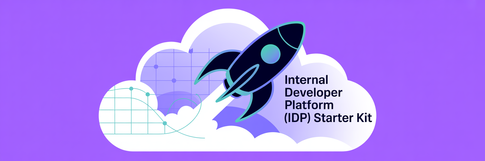

# Internal Developer Platform (IDP) Starter Kit

---
A ready-to-use architecture designed to turn Upbound Control Planes into a
streamlined, self-service platform for your engineering teams. Clone and tailor
it to your needs to roll out an Internal Developer Platform (IDP) that enables
developers to quickly spin up infrastructure that's production-ready,
policy-compliant, and governed by Upbound's control mechanisms and proven
patterns.


# Table of Contents
- [💡 Overview](#-overview)
- [🛠 Prerequisites](#-prerequisites)
- [📂 Project Layout](#-project-layout)
- [🔧 Configuration](#-configuration)
- [🐛 Debugging](#-debugging)
- [📚 Further Resources](#-further-resources)


---

## 💡 Overview

# What is an Internal Developer Platform (IDP)?

An Internal Developer Platform (IDP) is a self-service platform that sits on top of your infrastructure and development tools. It abstracts away complexity and provides developers with golden paths to follow when deploying and managing applications and infrastructure. IDPs help organizations strike the right balance between developer productivity and operational control. They reduce cognitive load on developers while ensuring infrastructure stays manageable, secure, and cost-effective.

# What Is a Control Plane?

A centralized management layer that enables the orchestration of cloud resources and services across multiple providers.

# Why Control Planes for IDPs?

Control planes are an ideal foundation for IDPs because they provide:

* **Centralized Management**: A single point of control for infrastructure across multiple clouds and services
* **Declarative APIs**: Abstract complex infrastructure into simple, consistent interfaces that developers can easily consume
* **Reconciliation**: Continuously monitors and automatically aligns actual infrastructure state with desired state

___ 
# This repository:

* Kickstarts a complete GitOps workflow for the **solution-idp** platform using Upbound
* It provisions control planes, deploys [ArgoCD](https://argoproj.github.io/cd/) and [Backstage](https://backstage.io/)
* It sets up syncing for environment manifests located under the `state/` directory

# Core capabilities enabled through the **Upbound `up` CLI**:

* Create and configure Control Planes (CTPs) within a designated organization
  and space
* Configure Crossplane providers and dependencies
* Deploy ArgoCD
* Install Backstage on an EKS cluster (AWS)
* Auto-sync manifests from structured state directories like `compute`, `db`,
  `frontend`, etc.

This solution has two available demo setups:

* `solution-idp-non-prod`
* `solution-idp-prod`

---

## 🛠 Prerequisites

Before you start, make sure you have:

* A Unix-like system (macOS/Linux/WSL) 
* Docker Dekstop 
* `kubectl`
* [Upbound CLI (`up`)](https://docs.upbound.io/cli/)
* [An Upbound Account](https://www.upbound.io/register/a)
* Access to an Upbound Space and Organization
* AWS credentials stored at `/Users/$USER/.aws/aws.json` (customizable in
  `Taskfile.yaml`)

---

## 💻 Getting Started with Taskfile

This project leverages [`Task`](https://taskfile.dev) for automating setup
steps. To get going:

### 1. Clone this repository

```bash
git clone https://github.com/upbound/solution-idp.git
cd solution-idp
```

### 2. Install [Task CLI](https://taskfile.dev/installation/)

```bash
brew install go-task/tap/go-task
```

### 3. Bootstrap your environment

The `bootstrap-all` process will:

* Ensure the `up` CLI is installed and ready
* Initialize the root group and control plane
* Set up bootstrap Upbound Control Plane along with its components
* Create secrets and provider configurations
* Deploy ArgoCD

```bash
task bootstrap-all
```

Once running, ArgoCD will begin syncing from the enviroments outlined in `environments.yaml`:

```
state/solution-idp-non-prod
├── compute
├── db
├── frontend
├── network
```

Each subfolder represents a separate Upbound Control Plane / Group and may include:

* Crossplane Configurations
* Providers and Functions
* Upbound Controllers
* XRs and Claims
* ProviderConfigs

---

## 📂 Project Layout

```
.
├── _output/                   # Local Upbound CLI binary
├── state/                     # GitOps source of truth for environments
│   ├── solution-idp-non-prod/
│   └── solution-idp-prod/
├── Taskfile.yaml              # Main task runner config
└── README.md
```

Inside each environment directory:

| File/Directory | Description |
|---------------|-------------|
| `configurations.yaml` | List of Crossplane Configuration packages for bootstrap |
| `environments.yaml` | Logical environment definitions |
| Subdirectories like `frontend`, `db` | Kubernetes manifests |
| `Taskfile.yaml` | Environment-specific automation logic |

---

## 🔧 Configuration

Each environment folder (e.g., `state/solution-idp-non-prod/`) contains its own `Taskfile.yaml`, which defines settings specific to that environment.

You can adjust the following variables inside the environment-specific `Taskfile.yaml`:

| Variable | Description | Example |
|----------|-------------|---------|
| `AWS_CREDENTIALS_PATH` | Path to the AWS credentials file | `/Users/haarchri/.aws/aws.json` |
| `UPBOUND_ORG` | Upbound organization name | `idpcompany` |
| `UPBOUND_ORG_TEAM` | Team within the organization used for provisioning | `CI` |
| `SPACE` | Upbound Space where control planes will be deployed | `space-the-final-frontier` |
| `ROOT_GROUP_NAME` | The logical group name for this IDP environment | `solution-idp-non-prod` |
| `ROOT_CTP_NAME` | The name of the root Control Plane used to bootstrap | `bootstrap` |
| `GIT_REPO` | Git repository URL for sourcing manifests | `https://github.com/upbound/solution-idp.git` |
| `GIT_REVISION` | Git branch or revision to pull manifests from | `main` |

These values can differ per environment, allowing for tailored configurations between environments like `non-prod` and `prod`.

---

## 🐛 Debugging 

* **Missing `up` binary?** 

Run `task check-up` to install

* **Wrong org/space?** 

Verify using `up profile current`

---

## 📚 Further Resources

* [Upbound Documentation](https://docs.upbound.io/)
* [Crossplane.io](https://crossplane.io/)
* [ArgoCD](https://argo-cd.readthedocs.io/en/stable/)
* [Taskfile.dev](https://taskfile.dev/)

---

Enjoy building your IDP with Upbound Control Planes 🚀
